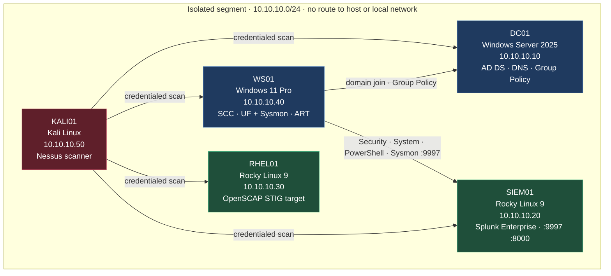

# Federal-Aligned Security Lab

An isolated virtual enterprise network built to practice the security controls used in federal and
defense-contractor environments: DISA STIG hardening, SCAP compliance scanning, credentialed
vulnerability assessment, centralized logging with ATT&CK-mapped detections, and NIST 800-53
control documentation.

Five virtual machines, a Windows domain, an attack platform, and a documented set of findings.

| Outcome | Result |
|---|---|
| RHEL 9 STIG compliance | 44.9% → **95.4%** · 258 failed rules to 17 |
| Windows 11 STIG compliance | 38.84% → **97.11%** · 148 failed rules to 7, 12 of 13 CAT I closed |
| Credentialed vulnerability findings | 21 critical and 35 high → **0** |
| Defects found in published DISA content | **4**, each reproducible and documented |


---

## Environment

| Host | OS | Role |
|---|---|---|
| **DC01** | Windows Server 2025 Standard | Active Directory Domain Services, DNS, Group Policy |
| **WS01** | Windows 11 Pro (25H2) | Domain-joined workstation, SCC scanning host; Splunk forwarder and Sysmon; attack simulation target |
| **RHEL01** | Rocky Linux 9.8 | STIG hardening target, OpenSCAP scanning |
| **SIEM01** | Rocky Linux 9.8 | Splunk Enterprise 10.4.3 — log collection, search, detections |
| **KALI01** | Kali Linux | Vulnerability scanner, attack platform |

All hosts sit on an isolated virtual network segment with no route to the physical host or any
production network. Internet access is temporary and deliberate — attached only for patching, then
removed.



See [`docs/architecture.md`](docs/architecture.md) for addressing, the VM inventory, and the
isolation design, and [`docs/network-diagram.md`](docs/network-diagram.md) for the log and
assessment flows.

### Active Directory

Single-forest domain `lab.local` on DC01, with WS01 joined and placed in a dedicated
Workstations OU so hardening policy can be scoped away from the domain controller.


---

## Stack

| Function | Tool | Status |
|---|---|---|
| Directory services | Active Directory Domain Services, DNS, Group Policy | In use |
| Linux compliance scanning | OpenSCAP with `scap-security-guide` (DISA STIG profile) | In use |
| Windows compliance scanning | SCAP Compliance Checker (SCC) 5.15 | In use |
| Vulnerability assessment | Tenable Nessus — credentialed and uncredentialed scanning | In use |
| Virtualization | VMware Workstation Pro | In use |
| Linux hardening | OpenSCAP-generated remediation, applied in reviewed stages | In use |
| Windows hardening | DISA STIG Group Policy Objects, scoped by OU with loopback processing | In use |
| Full-disk encryption | BitLocker, TPM + PIN pre-boot authentication, recovery keys escrowed to AD | In use |
| Password policy | Domain baseline plus fine-grained policy for privileged accounts | In use |
| Endpoint telemetry | Sysmon (built-in Windows feature), sysmon-modular configuration | In use |
| Log aggregation | Splunk Enterprise 10.4.3 with Universal Forwarder | In use |
| Detection engineering | SPL searches mapped to MITRE ATT&CK | In progress |
| Adversary emulation | Atomic Red Team | Planned |
| Control documentation | NIST SP 800-53 Rev. 5 control references, POA&M | In use |

---

## Compliance hardening

Baseline scan, remediation, rescan, against DISA STIG benchmarks.

| Target | Benchmark | Tool | Before | After |
|---|---|---|---|---|
| RHEL01 | DISA STIG for RHEL 9 | OpenSCAP 1.3.14 | 44.9% | **95.4%** |
| WS01 | Microsoft Windows 11 STIG V2R10 | SCC 5.15 | 38.84% | **97.11%** |
| DC01 | Microsoft Windows Server 2025 STIG V1R1 | SCC 5.15 | 42.74% | Deferred — [POA&M](docs/poam.md) |

Baseline rule counts, all scans run against the MAC-2 Sensitive profile:

| Target | Pass | Fail | N/A | Not checked | CAT I fail | CAT II fail | CAT III fail |
|---|---|---|---|---|---|---|---|
| RHEL01 | 167 | 258 | 42 | 10 | 11 | 224 | 20 |
| WS01 | 94 | 148 | 5 | 10 | 13 | 127 | 8 |
| DC01 | 103 | 138 | 21 | 29 | 11 | 119 | 8 |

After remediation, same benchmark, profile, and scoring method:

| Target | Pass | Fail | N/A | Not checked | CAT I fail | CAT II fail | CAT III fail |
|---|---|---|---|---|---|---|---|
| RHEL01 | 410 | 17 | 40 | 10 | 1 | 11 | 5 |
| WS01 | 235 | 7 | 5 | 10 | 1 | 6 | 0 |

**RHEL01:** 258 failed rules reduced to 17, applied in five reviewed stages with a snapshot and a
login test between each. Method, deviations, and a conflict found inside the benchmark content:
[`docs/rhel01-remediation.md`](docs/rhel01-remediation.md).

**WS01:** 148 failed rules reduced to 7, including 12 of 13 CAT I findings, using DISA's published
Group Policy Objects scoped to a Workstations OU with supplemental policy for the gaps the package
leaves open. The work surfaced three defects in the published GPO package — contradictory BitLocker
startup options, an omitted recovery-escrow policy that leaves an encrypted host unrecoverable, and
two releases of drift behind the benchmark being scanned against:
[`docs/ws01-stig-gpo.md`](docs/ws01-stig-gpo.md).

Every remaining failure on both hosts has a stated reason and carries into the
[POA&M](docs/poam.md).

### Defects found in the published content

Applying STIG content carefully surfaces problems in the content itself. Four, each reproducible:

| Finding | Effect |
|---|---|
| The Windows 11 GPO package's BitLocker startup options are mutually exclusive — TPM-only permitted, a startup PIN required, and no-TPM operation allowed simultaneously | `Enable-BitLocker` refuses the combination with `0x8031005B`. Resolved by a scoped override GPO |
| The same package enforces pre-boot authentication but never sets the recovery-escrow policy | A host configured strictly from the package encrypts behind a PIN with **no recovery key escrowed anywhere**. One forgotten PIN makes it unrecoverable |
| The GPO package is two releases behind the SCAP benchmark published alongside it, and its manifest lists GUIDs the archive does not contain | Three V2R10 rules have no setting in the v2r8 package and fail after a clean import. Supplemental policy supplies them |
| `scap-security-guide` 0.1.82 contains rules demanding mutually exclusive SSH MAC orderings | No configuration satisfies all three. Documented with the ordering chosen and the rule it costs |

None of these are visible from a passing score. They came out of reading the OVAL definitions behind
the rules rather than the rule titles — which also changed the BitLocker remediation from a
multi-hour full-volume re-encryption into a metadata operation, once it was clear the rule tests
protection status alone.

RHEL01, OpenSCAP — baseline then post-remediation:


WS01, SCAP Compliance Checker — baseline then post-remediation:


### Scan scope

SIEM01 and KALI01 are excluded from compliance scanning — SIEM01 as the monitoring platform,
KALI01 as the assessment platform. WS01 runs Windows 11 Pro, so the two STIG rules that depend on an
Enterprise-only feature — Credential Guard, and the edition requirement behind it — cannot be
satisfied. Rationale for all three in
[`docs/architecture.md`](docs/architecture.md).

**DC01 is assessed but not remediated in this phase.** It is the sole domain controller, with no
replication partner. The Server 2025 STIG's authentication controls — LDAP and SMB signing, NTLM
restrictions, Kerberos encryption types — alter the authentication path every other host depends on,
including the scanner service account and the administrative access used to perform the remediation.
Applying them without a second domain controller and a per-dependency rollback plan exceeds the risk
tolerance for this phase, so the baseline stands and the deferral is recorded with its reasoning in
the [POA&M](docs/poam.md).

---

## Vulnerability assessment

Nessus scans from KALI01 against all four non-scanner hosts. An uncredentialed baseline was taken
first to establish the external view, then a credentialed scan with domain and SSH credentials.

| Scan | Hosts | Unique plugins | Finding instances | Duration |
|---|---|---|---|---|
| Uncredentialed baseline | 4 | 40 | 70 | 22 min |
| Credentialed baseline | 4 | 244 | 421 | 29 min |
| Credentialed, post-patch | 4 | 187 | 378 (all informational) | — |

| Host | Uncredentialed | Credentialed | Critical | High | Medium | Low |
|---|---|---|---|---|---|---|
| DC01 | 30 | 143 | 0 | 3 | 0 | 0 |
| WS01 | 12 | 186 | 21 | 32 | 5 | 1 |
| RHEL01 | 23 | 54 | 0 | 0 | 0 | 1 |
| SIEM01 | 5 | 38 | 0 | 0 | 0 | 1 |
| **Total** | **70** | **421** | **21** | **35** | **5** | **3** |

Credentialed scanning returned 6× the findings from the same hosts on the same network. An
uncredentialed scan enumerates open ports and service banners, but cannot read installed package
versions or local configuration, which is where missing patches live.

WS01 carries every critical finding and 32 of 35 highs. The Rocky Linux hosts, patched during their
build, returned no critical, high, or medium findings.

| Severity | Baseline (credentialed) | Post-patch | Remaining in POA&M |
|---|---|---|---|
| Critical | 21 | **0** | — |
| High | 35 | **0** | — |
| Medium | 5 | **0** | — |
| Low | 3 | **0** | — |

All 64 actionable findings were closed: 57 by patching WS01 and DC01, 4 by specific configuration
fixes (WinVerifyTrust certificate padding check on both Windows hosts, the Intel BHI speculative
execution mitigation, and a pending-reboot completion), 2 by blocking ICMP timestamp requests on the
Linux hosts, and 1 by updating Defender signatures. Details in
[`scans/nessus/post-patch-credentialed-20260921.md`](scans/nessus/post-patch-credentialed-20260921.md).


Scanning used a dedicated `svc-nessus` domain account rather than a Domain Admin, since the Windows
11 STIG denies privileged domain accounts logon rights on workstations. Remote Registry was enabled
only for the scan window and disabled afterwards.

Full reports are in [`scans/`](scans/).

---

## Detection engineering
**Status:** in progress — pipeline live, detections not yet validated.

WS01 forwards Windows Security, System, PowerShell, and Sysmon events to Splunk on SIEM01. The
build, the forwarder's least-privilege design, and the Sysmon configuration's provenance are in
[`docs/logging-pipeline.md`](docs/logging-pipeline.md); the deployed configuration is in
[`config/`](config/). Telemetry is host-based: Sysmon records which process opened a network
connection, but no packet or flow data is collected.

Each detection is written against a stated hypothesis, and is not counted as a detection until it
has been validated by executing the corresponding Atomic Red Team test and confirming the search
fires on real telemetry.

| Technique | ATT&CK ID | Log source | Detection |
|---|---|---|---|
| PowerShell | T1059.001 | Sysmon EID 1, PowerShell 4104 | — |
| Create Account: Local Account | T1136.001 | Security 4720, 4732 | [`T1136.001`](detections/T1136.001-local-account-creation.md) |
| Scheduled Task/Job | T1053.005 | Security 4698, Sysmon EID 1 | — |
| Abuse Elevation Control: UAC Bypass | T1548.002 | Sysmon EID 1, 13 | — |
| Clear Windows Event Logs | T1070.001 | Security 1102, System 104 | — |

---

## Documentation

| Artifact | Contents |
|---|---|
| [`docs/architecture.md`](docs/architecture.md) | Environment design, isolation model, addressing, scan scope |
| [`docs/network-diagram.md`](docs/network-diagram.md) | Topology and data flows |
| [`docs/logging-pipeline.md`](docs/logging-pipeline.md) | Splunk, forwarder, and Sysmon build: verification, least privilege, configuration provenance |
| [`docs/internet-windows.md`](docs/internet-windows.md) | Log of temporary internet access for patching |
| [`docs/rhel01-remediation.md`](docs/rhel01-remediation.md) | RHEL01 STIG remediation: staging, deviations, and open items |
| [`docs/ws01-stig-gpo.md`](docs/ws01-stig-gpo.md) | WS01 STIG remediation: GPO import and scoping, package defects, BitLocker, VBS |
| [`docs/poam.md`](docs/poam.md) | Plan of Action and Milestones — every open finding with its reason and closure path |

---

## Repository

```
federal-homelab/
├── docs/           architecture, remediation method, POA&M
├── scans/          OpenSCAP, SCC, and Nessus results
├── detections/     SPL searches with ATT&CK mapping
├── config/         Splunk and Sysmon configuration as deployed
├── scripts/        scan automation
└── screenshots/    walkthrough evidence
```

---

## Notes

A personal training environment, not an accredited system. Compliance percentages describe lab
virtual machines, each as of the dated scan in `scans/`: WS01's forwarder and Sysmon were installed
after its post-remediation scan and it has not been rescanned since. STIG and SCAP content is
published by DISA and NIWC Atlantic; this repository contains only results generated against it.

### AI assistance

I used Claude (Anthropic) as a working partner through the build and remediation phases. "AI
assisted" can mean anything from proofreading to generating the whole project, so the split is
stated precisely:

| Performed by me | AI-assisted |
|---|---|
| Built and configured the environment: five virtual machines, the isolated segment, the `lab.local` domain, and the OU design | Phase planning and the order work was carried out in |
| Ran every OpenSCAP, SCC, and Nessus scan on my own hosts | Reading the OVAL and XCCDF internals of the resulting reports and explaining what a rule actually tests |
| Executed every remediation command, GPO import, and policy change | Proposing those commands and the `scripts/` contents, which I reviewed before running |
| Diagnosed and recovered from failures — filesystem corruption during patching, a truncated virtual disk, and a workstation that logged in to no shell | Interpreting error output I pasted back, and narrowing the hypotheses |
| Every decision: scope, risk acceptance, what to defer, when to roll back, what to publish | Drafting the prose in this README and `docs/`, which I reviewed and edited |
| All screenshots and every figure in this repository | Looking up vendor documentation and version specifics |

Every number here comes from a scan I ran against these machines, recorded in a report committed to
`scans/`. No figure, result, or scan output in this repository was produced by AI.

Where AI guidance and observed output disagreed, the output won. Two examples worth naming, because
they are the reason the verification steps in `docs/` exist: a Group Policy migration-table
instruction was given backwards, which would have silently imported unresolvable principals into
User Rights Assignment and left the workstation reporting as configured while enforcing nothing —
caught by exporting the applied policy and checking for resolved SIDs rather than trusting the GPO
report. Separately, a proposed root cause for a PowerShell module failure was contradicted by the
evidence, and the actual cause turned out to be a corrupt file the servicing tools could not repair.

Commits where AI assisted carry a `Co-Authored-By` trailer, so the history distinguishes them.
