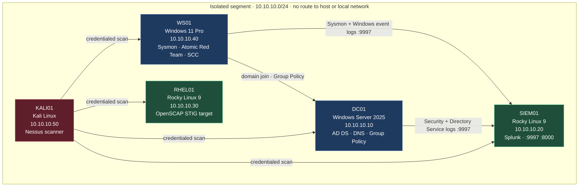
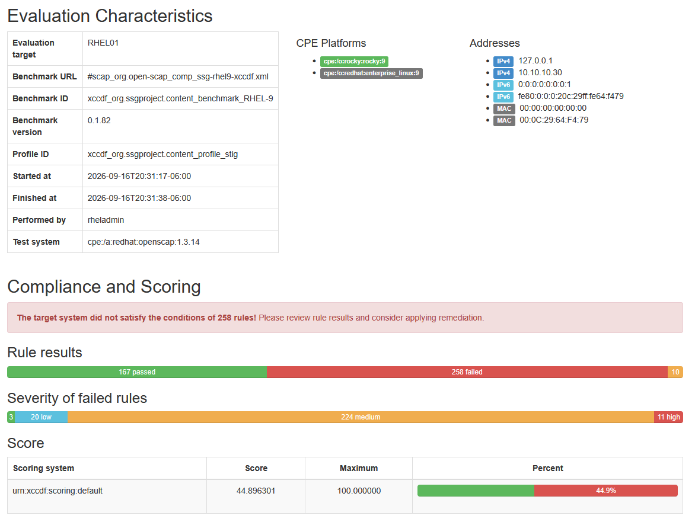
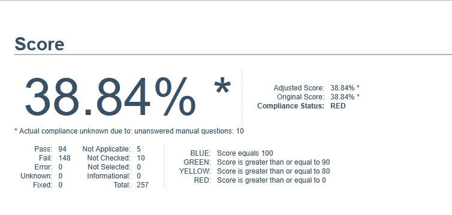
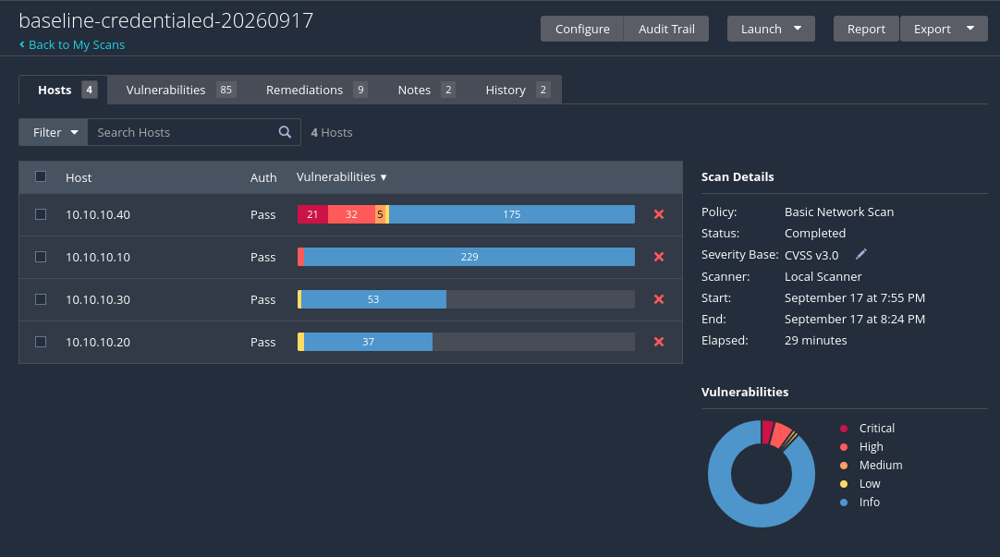

# Federal-Aligned Security Lab

An isolated virtual enterprise network built to practice the security controls used in federal and
defense-contractor environments: DISA STIG hardening, SCAP compliance scanning, credentialed
vulnerability assessment, centralized logging with ATT&CK-mapped detections, and NIST 800-53
control documentation.

Five virtual machines, a Windows domain, an attack platform, and a documented set of findings.

---

## Environment

| Host | OS | Role |
|---|---|---|
| **DC01** | Windows Server 2025 Standard | Active Directory Domain Services, DNS, Group Policy |
| **WS01** | Windows 11 Pro (25H2) | Domain-joined workstation, Sysmon telemetry, attack simulation target |
| **RHEL01** | Rocky Linux 9.8 | STIG hardening target, OpenSCAP scanning |
| **SIEM01** | Rocky Linux 9.8 | Splunk indexer, centralized log collection |
| **KALI01** | Kali Linux | Vulnerability scanner, attack platform |

All hosts sit on an isolated virtual network segment with no route to the physical host or any
production network. Internet access is temporary and deliberate — attached only for patching, then
removed.



See [`docs/architecture.md`](docs/architecture.md) for addressing and isolation design, and
[`docs/network-diagram.md`](docs/network-diagram.md) for the full topology.

---

## Stack

| Function | Tool |
|---|---|
| Directory services | Active Directory Domain Services, DNS, Group Policy |
| Linux compliance scanning | OpenSCAP with `scap-security-guide` (DISA STIG profile) |
| Windows compliance scanning | SCAP Compliance Checker (SCC) 5.15 |
| Windows hardening | DISA STIG Group Policy Objects |
| Vulnerability assessment | Tenable Nessus — credentialed and uncredentialed scanning |
| Endpoint telemetry | Sysmon |
| Log aggregation | Splunk Enterprise with Universal Forwarders |
| Detection engineering | SPL searches mapped to MITRE ATT&CK |
| Adversary emulation | Atomic Red Team |
| Control documentation | NIST SP 800-53 Rev. 5, RMF artifacts |
| Virtualization | VMware Workstation Pro |

---

## Compliance hardening

Baseline scan, remediation, rescan, against DISA STIG benchmarks. Findings that cannot be
remediated are tracked in the [POA&M](docs/poam.md) with a written justification.

| Target | Benchmark | Tool | Before | After |
|---|---|---|---|---|
| RHEL01 | DISA STIG for RHEL 9 | OpenSCAP 1.3.14 | 44.9% | — |
| WS01 | Microsoft Windows 11 STIG V2R10 | SCC 5.15 | 38.84% | — |
| DC01 | Microsoft Windows Server 2025 STIG V1R1 | SCC 5.15 | 42.74% | — |

Baseline rule counts, all scans run against the MAC-2 Sensitive profile:

| Target | Pass | Fail | N/A | Not checked | CAT I fail | CAT II fail | CAT III fail |
|---|---|---|---|---|---|---|---|
| RHEL01 | 167 | 258 | 10 | — | 11 | 224 | 20 |
| WS01 | 94 | 148 | 5 | 10 | 13 | 127 | 8 |
| DC01 | 103 | 138 | 21 | 29 | 11 | 119 | 8 |





Linux remediation uses OpenSCAP-generated fix scripts, reviewed and applied in stages. Windows
remediation uses the DISA STIG GPO package imported into Active Directory and linked to a scoped
organizational unit.


### Scan scope

SIEM01 and KALI01 are excluded from compliance scanning — SIEM01 as the monitoring platform,
KALI01 as the assessment platform. WS01 runs Windows 11 Pro, so STIG rules requiring
Enterprise-only features (Credential Guard, AppLocker) cannot be satisfied and are recorded in the
POA&M rather than counted as remediation failures. Rationale for all three in
[`docs/architecture.md`](docs/architecture.md).

---

## Vulnerability assessment

Nessus scans from KALI01 against all four non-scanner hosts. An uncredentialed baseline was taken
first to establish the external view, then a credentialed scan with domain and SSH credentials.

| Scan | Hosts | Unique findings | Duration |
|---|---|---|---|
| Uncredentialed baseline | 4 | 32 | 22 min |
| Credentialed baseline | 4 | 85 | 29 min |

Per-host finding counts:

| Host | Uncredentialed | Credentialed | Critical | High | Medium |
|---|---|---|---|---|---|
| DC01 | 58 | 229 | 0 | 3 | 0 |
| WS01 | 20 | 233 | 21 | 32 | 5 |
| RHEL01 | 22 | 53 | 0 | 0 | 0 |
| SIEM01 | 5 | 37 | 0 | 0 | 0 |
| **Total** | **105** | **552** | **21** | **35** | **5** |

Credentialed scanning returned 2.7× the unique findings and 5.3× the total instances from the same
hosts on the same network — an uncredentialed scan enumerates open ports and service banners, but
cannot read installed package versions or local configuration, which is where missing patches live.

WS01 carries every critical finding and 32 of 35 highs. The Rocky Linux hosts, patched during their
build, returned no critical, high, or medium findings.

| Severity | Baseline (credentialed) | Post-remediation | Remaining in POA&M |
|---|---|---|---|
| Critical | 21 | — | — |
| High | 35 | — | — |
| Medium | 5 | — | — |



Full reports are in [`scans/`](scans/).

---

## Detection engineering

Windows Security, PowerShell, and Sysmon logs forward from DC01 and WS01 into Splunk. Each
detection is written against a stated hypothesis, then validated by executing the corresponding
Atomic Red Team test and confirming the search fires on real telemetry.

| Technique | ATT&CK ID | Log source | Detection |
|---|---|---|---|
| PowerShell | T1059.001 | Sysmon EID 1, PowerShell 4104 | — |
| Create Account: Local Account | T1136.001 | Security 4720, 4732 | [`T1136.001`](detections/T1136.001-local-account-creation.md) |
| Scheduled Task/Job | T1053.005 | Security 4698, Sysmon EID 1 | — |
| Abuse Elevation Control: UAC Bypass | T1548.002 | Sysmon EID 1, 13 | — |
| Clear Windows Event Logs | T1070.001 | Security 1102, System 104 | — |


Each detection documents the hypothesis, the SPL, expected false positives, analyst response steps,
and what it does not catch. Full set in [`detections/`](detections/).


---

## Documentation

| Artifact | Contents |
|---|---|
| [`docs/architecture.md`](docs/architecture.md) | Environment design, isolation model, addressing, scan scope |
| [`docs/network-diagram.md`](docs/network-diagram.md) | Topology and data flows |

---

## Repository

```
federal-security-lab/
├── docs/           architecture, network diagram
├── configs/        Sysmon config, Splunk inputs/outputs, GPO notes
├── scans/          OpenSCAP, SCC, and Nessus results
├── detections/     SPL searches with ATT&CK mapping
├── scripts/        scan automation
└── screenshots/    walkthrough evidence
```

---

## Notes

A personal training environment, not an accredited system. Compliance percentages describe lab
virtual machines. STIG and SCAP content is published by DISA and NIWC Atlantic; this repository
contains only results generated against it.

AI assistance (Claude, Anthropic) was used for planning, drafting documentation, and reviewing
configurations. All scanning, hardening, and detection validation was performed by me in this
environment, and every figure above traces to a scan output committed to `scans/`.
