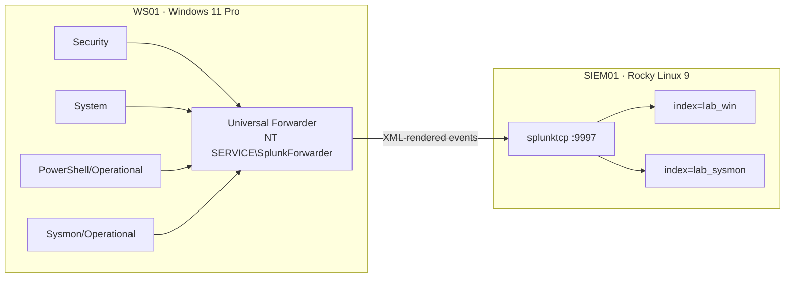

# Logging Pipeline

**Status:** live for WS01 as of 2026-09-23. Four of five detections validated with Atomic Red Team
on 2026-09-24 — see [`detections/`](../detections/).

WS01 forwards Windows Security, System, PowerShell, and Sysmon events to Splunk Enterprise on
SIEM01. Every configuration file that defines the pipeline is committed under
[`config/`](../config/) exactly as deployed.

## Components

| Component | Host | Version | Verified before install |
|---|---|---|---|
| Splunk Enterprise | SIEM01 | 10.4.3, build `4174a2deda5d`, RPM | SHA-512 matched Splunk's published checksum; RPM signature verified against Splunk's release key, key ID `b3cd4420` (long ID `5EFA01EDB3CD4420`) |
| Splunk Universal Forwarder | WS01 | 10.4.3, build `4174a2deda5d`, x64 MSI | SHA-512 matched Splunk's published checksum |
| Splunk Add-on for Microsoft Windows | SIEM01 | 11.0.2 | SHA-256 recorded at download and matched after transfer |
| Splunk Add-on for Sysmon | SIEM01 | 5.0.1 | SHA-256 recorded at download and matched after transfer |
| Sysmon | WS01 | Built-in Windows optional feature, `sysmon.exe` 10.0.26100.8972 | Serviced through Windows Update |
| Sysmon configuration | WS01 | sysmon-modular release `configs-082cba578667`, schema 4.91 | SHA-256 recorded; one local change, below |

A package's checksum proves it arrived intact. Only the RPM signature proves who published it, and
the key ID links three independent sources: Splunk's documentation page, the downloaded key file,
and the signature embedded in the package.

## SIEM01

| Setting | Value | Reason |
|---|---|---|
| Service | systemd `Splunkd.service`, runs as the unprivileged `splunk` user | Splunk never runs as root |
| Splunk Web | TLS enabled, port 8000 | The administrator login is not sent in cleartext. The certificate is self-signed — see [POA&M ENV-005](poam.md) |
| Receiving | `splunktcp` on 9997 | Plaintext — see [POA&M ENV-005](poam.md) |
| Indexes | `lab_win` and `lab_sysmon` 10 GB, `lab_linux` 5 GB, 90-day retention | Storage is bounded, and aging out is predictable rather than a full disk (AU-4, AU-11) |
| Host firewall | 8000 and 9997 accepted from `10.10.10.0/24` only; unused `cockpit` and `dhcpv6-client` services removed | Nothing outside the lab segment can reach Splunk |
| Name resolution | Static A records for `siem01` and `rhel01` on DC01 | The Linux hosts are not domain-joined, so they never registered themselves |

SIEM01 was patched during a logged internet window before Splunk was installed
([`internet-windows.md`](internet-windows.md)).

## WS01 forwarder: least privilege

The 10.4 installer runs the forwarder as a virtual account and, by default, grants it three user
rights. Each was declined at install time:

| Installer default | Why declined | Replaced by |
|---|---|---|
| `SeSecurityPrivilege` | Read/write by design — it would let the forwarder clear the Security log. The Windows 11 STIG restricts it to Administrators | Membership in Event Log Readers, which is read-only |
| `SeBackupPrivilege` | Reads any file on the system; not needed for event logs. STIG restricts it to Administrators | — |
| `SeImpersonatePrivilege` | Not needed for event collection | — |
| Performance Monitor Users | No performance counters are collected | — |

Every channel collected grants read access to Event Log Readers (`S-1-5-32-573`) in its channel
security descriptor, including the Sysmon channel, so group membership is the only access the
forwarder needs.

The resulting state was checked after `gpupdate /force` rather than at install, because Group Policy
rewrites user rights assignments on refresh. After the refresh, `SeSecurityPrivilege` and
`SeBackupPrivilege` were still held by Administrators only, the forwarder was still a member of
Event Log Readers, and events continued to arrive. The installer's one addition that remained is
the forwarder's service SID in `SeServiceLogonRight`, which is redundant — `NT SERVICE\ALL
SERVICES` already holds that right.

## Sysmon configuration

The configuration is sysmon-modular's default ("medium verbosity") build from release
`configs-082cba578667`. The download link used, `releases/latest/download/…`, moves with every
release, so the record names the release it resolved to; the configuration on the project's
`master` branch is an older source version and does not match it.

One change was made before loading — [`config/ws01/sysmon/sysmonconfig-lab.diff`](../config/ws01/sysmon/sysmonconfig-lab.diff):
`HashAlgorithms` from `*` to `SHA256`. MD5 and SHA-1 are not FIPS-approved, and dropping them
shortens every event. `sysmon -c` reports the loaded configuration's hash, and it matches the
committed lab file.

### Two sources of process execution

The sysmon-modular configuration records process creation only when a rule matches, and tags each
event with the ATT&CK technique it matched (`technique_id=T1033` for `whoami.exe`, for example).
Most processes on the workstation are therefore absent from Sysmon event 1 by design. Security
event 4688 records every process, with command line. The detections use each for what it is good at:

| Source | Role |
|---|---|
| Security 4688, with command-line auditing | Completeness — every process |
| Sysmon event 1 | Parent image, hashes, ATT&CK rule name — where the configuration matches |
| Sysmon event 13 | Registry value writes; the only source for registry-based UAC bypass |

The Sysmon add-on was confirmed to extract fields from the built-in Sysmon's events: the event ID
extracted from the raw XML matched the add-on's `EventCode` for every event type present at the
time, and `Image`, `CommandLine`, `ParentImage`, and `RuleName` populate on process-creation events.

## Findings from the build

**A pasted configuration file was silently corrupted.** The first `inputs.conf` was written from
multi-line text pasted into a PowerShell console, and the paste dropped a line break: the
PowerShell input's stanza header was joined to the end of the previous line and became part of a
value, so that channel was never collected. Security and System events arrived normally, so
nothing looked wrong until the PowerShell channel came up empty. `btool`, which prints the
configuration Splunk actually loads, showed two input stanzas where three had been written. The
file was rewritten from a line array that a paste cannot join, and every configuration since has
been checked with `btool` rather than by reading back what was written.

A second suspicion from the same investigation turned out to be wrong. `outputs.conf` and
`app.conf` were smaller on disk than their intended content, which looked like the same corruption.
Reading them showed intact files: text pasted into a console carries bare line feeds, while
`Set-Content` writes carriage-return line feeds, and the byte difference was the line endings. A
file's size is an inference; its contents are the evidence.

**Event volume is dominated by bursts, not the steady rate.** A `gpupdate /force` produced a burst
of Security events far above the host's idle rate — WS01 audits registry and handle operations —
and projecting that burst forward suggested the trial license's 500 MB/day limit was at risk.
Measured over an idle hour instead, the steady rate was a small fraction of the limit and no
filtering was needed. Only new events are collected (`current_only = 1`), so historical logs were
never backfilled against the license.
