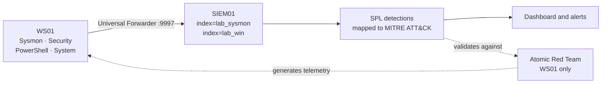
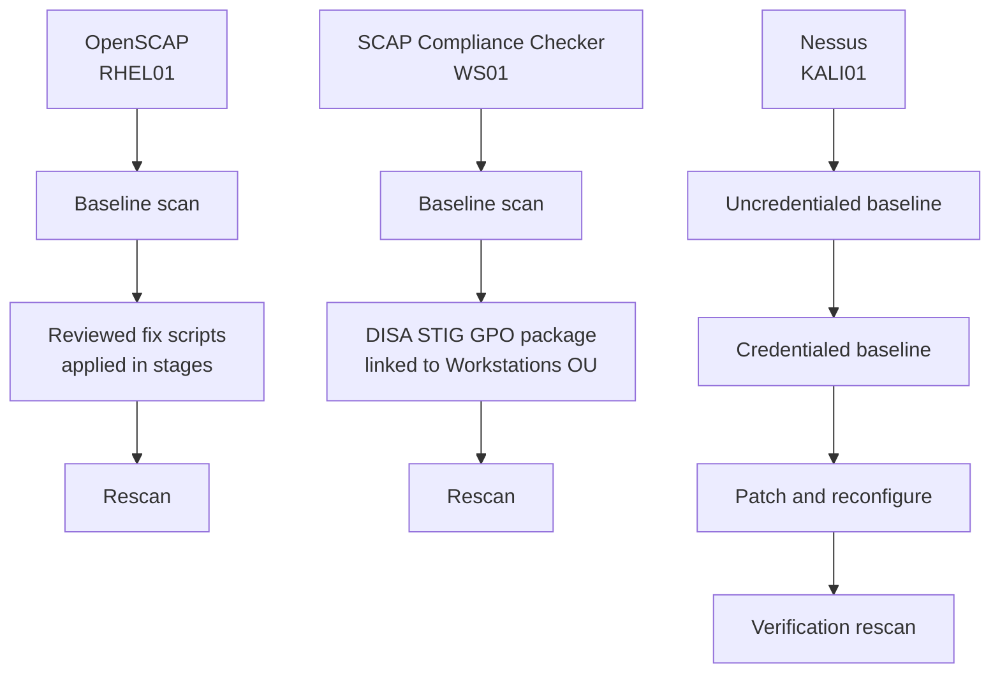

# Network Diagram

## Topology

The segment layout and host roles are diagrammed in the
[README](../README.md#environment) and are not duplicated here, so the two cannot drift apart.
Addressing, the isolation boundary, and the VM inventory are in
[`architecture.md`](architecture.md).

## Log flow

**Status:** live for WS01 since 2026-09-23; detections validated 2026-09-24. Build details in
[`logging-pipeline.md`](logging-pipeline.md).

## Assessment flow

