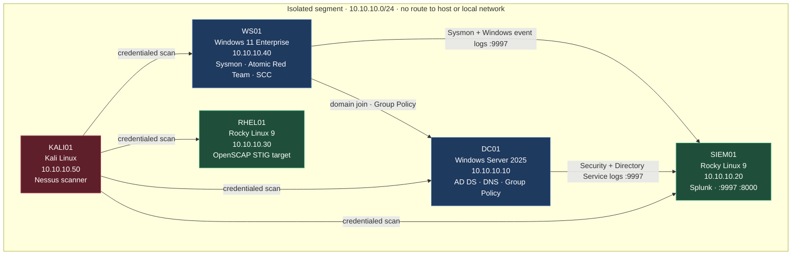
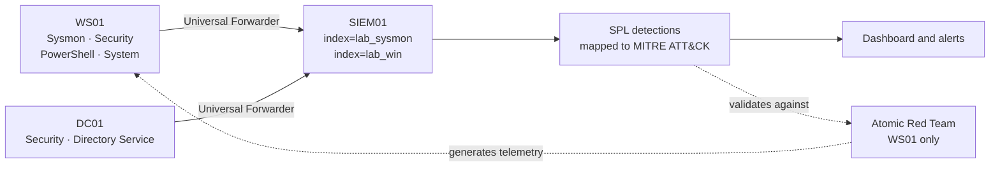
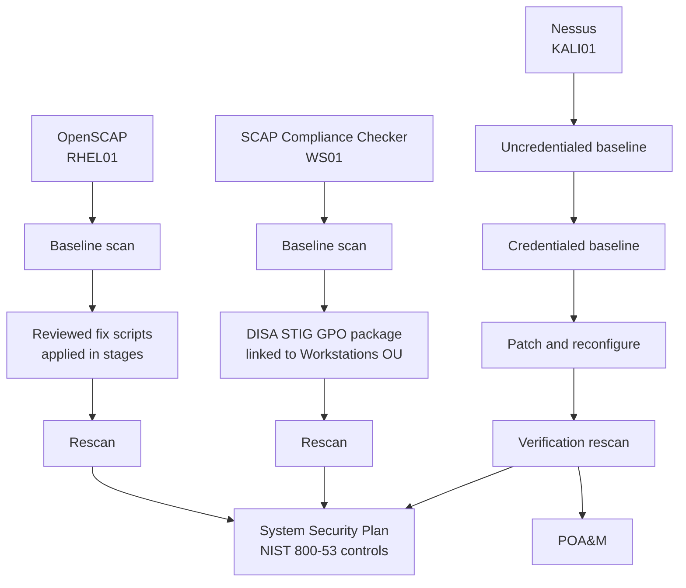

# Network Diagram

## Topology

```mermaid
graph TB
    subgraph LABNET["Isolated segment · 10.10.10.0/24 · no route to host or local network"]
        DC01["DC01<br/>Windows Server 2025<br/>10.10.10.10<br/>AD DS · DNS · Group Policy"]
        SIEM01["SIEM01<br/>Rocky Linux 9<br/>10.10.10.20<br/>Splunk · :9997 :8000"]
        RHEL01["RHEL01<br/>Rocky Linux 9<br/>10.10.10.30<br/>OpenSCAP STIG target"]
        WS01["WS01<br/>Windows 11 Enterprise<br/>10.10.10.40<br/>Sysmon · Atomic Red Team · SCC"]
        KALI01["KALI01<br/>Kali Linux<br/>10.10.10.50<br/>Nessus scanner"]
    end

    WS01 -->|"domain join · Group Policy"| DC01
    WS01 -->|"Sysmon + Windows event logs :9997"| SIEM01
    DC01 -->|"Security + Directory Service logs :9997"| SIEM01
    KALI01 -->|"credentialed scan"| DC01
    KALI01 -->|"credentialed scan"| WS01
    KALI01 -->|"credentialed scan"| RHEL01
    KALI01 -->|"credentialed scan"| SIEM01

    classDef win fill:#1f3a5f,stroke:#4a7ab8,color:#ffffff
    classDef lin fill:#1f4f3a,stroke:#4ab887,color:#ffffff
    classDef atk fill:#5f1f2a,stroke:#b84a5f,color:#ffffff
    class DC01,WS01 win
    class SIEM01,RHEL01 lin
    class KALI01 atk
```

## Log flow

```mermaid
flowchart LR
    A["WS01<br/>Sysmon · Security<br/>PowerShell · System"] -->|"Universal Forwarder"| D["SIEM01<br/>index=lab_sysmon<br/>index=lab_win"]
    B["DC01<br/>Security · Directory Service"] -->|"Universal Forwarder"| D
    D --> E["SPL detections<br/>mapped to MITRE ATT&CK"]
    E --> F["Dashboard and alerts"]
    G["Atomic Red Team<br/>WS01 only"] -.->|"generates telemetry"| A
    E -.->|"validates against"| G
```

## Assessment flow

```mermaid
flowchart TB
    S1["OpenSCAP<br/>RHEL01"] --> R1["Baseline scan"]
    R1 --> REM1["Reviewed fix scripts<br/>applied in stages"]
    REM1 --> R2["Rescan"]

    S2["SCAP Compliance Checker<br/>WS01"] --> R3["Baseline scan"]
    R3 --> REM2["DISA STIG GPO package<br/>linked to Workstations OU"]
    REM2 --> R4["Rescan"]

    S3["Nessus<br/>KALI01"] --> R5["Uncredentialed baseline"]
    R5 --> R6["Credentialed baseline"]
    R6 --> REM3["Patch and reconfigure"]
    REM3 --> R7["Verification rescan"]
    R7 --> POAM["POA&M"]

    R2 --> SSP["System Security Plan<br/>NIST 800-53 controls"]
    R4 --> SSP
    R7 --> SSP
```
