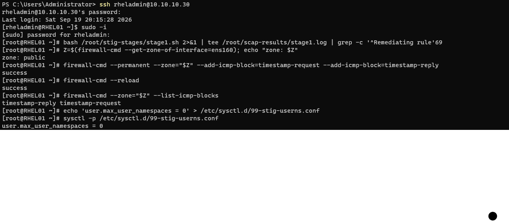

# RHEL01 STIG remediation

How RHEL01 went from 44.9% to 95.4% against the DISA STIG for RHEL 9, what was deliberately not
applied, and where the applied configuration departs from the generated fixes.

| | |
|---|---|
| Baseline | [2026-09-16](../scans/openscap/rhel01-baseline-20260916.md) — 44.9%, 258 failed rules |
| Post-remediation | [2026-09-20](../scans/openscap/rhel01-post-20260920.md) — 95.4%, 17 failed rules |
| Benchmark | DISA STIG for RHEL 9, SSG 0.1.82, profile `stig`, unchanged between scans |

## Method

1. Rescanned the unmodified host and confirmed it reproduced the baseline score, so the rescan
   method was proven before anything changed.
2. Pinned `openscap*` and `scap-security-guide` in `dnf.conf`. Patching a host normally upgrades
   the benchmark content, which would make the before/after comparison meaningless.
3. Generated the fix script **from the scan results** rather than from the profile, so it covers
   only the rules that actually failed (258 of them).
4. Reviewed every fix, then split them into five stages by blast radius. 233 rules were applied by
   script, unmodified; the rest were handled manually or left open.
5. Applied one stage at a time, each preceded by a VM snapshot and followed by a reboot and a
   login test from a second session before the first was closed.

| Stage | Rules | Contents |
|---|---|---|
| 1 | 69 | Packages, login banner, Ctrl-Alt-Del, sysctl hardening, kernel module blacklists, `/boot` and `/dev/shm` mount options, chrony, postfix |
| 2 | 92 | AIDE, audit rules (immutable), auditd disk-space actions, audit kernel arguments |
| 3 | 41 | authselect, faillock, pwquality, sudo re-authentication, password aging, umask, session limits |
| 4 | 21 | Crypto policy `FIPS:STIG`, 19 sshd settings |
| 5 | 10 | GRUB kernel arguments, fapolicyd default deny, usbguard |
| Manual | 5 | FIPS mode, GRUB superuser and password, `user.max_user_namespaces`, usbguard audit backend, postfix relay restriction |

Stage 1 applied, followed by two of the manual deviations described below — the firewalld ICMP
block and the user-namespace restriction:

## Deviations from the generated fixes

Four changes depart from what the content produced. Each is a deliberate, documented decision.

| Change | Reason |
|---|---|
| `maxdistance 16` in `chrony.conf` | The lab's only time authority is the domain controller, and Windows Time advertises a ±10 s error bound. Chrony's 3 s default rejected it, so the host had never synchronised at all — before or after hardening. Not a STIG rule, but accurate time underpins the audit records the STIG requires |
| `PrivateUsers=false` drop-in for `irqbalance` | The STIG's `user.max_user_namespaces=0` prevents any service using a user namespace from starting. irqbalance was the only enabled service affected; it keeps its other 14 sandbox settings |
| ICMP timestamp request/reply blocked in firewalld | Closes a Nessus finding (plugin 10114) that no STIG rule covers |
| `mac@SSH` order in `STIG.pmod` | See below |

## A conflict inside the benchmark

Three rules in SSG 0.1.82 disagree about SSH MAC ordering, and they cannot all pass at once:

| Rule | Expects |
|---|---|
| `fips_custom_stig_sub_policy` | `mac@SSH=HMAC-SHA2-512 HMAC-SHA2-256` in `STIG.pmod` |
| `harden_sshd_macs_openssh_conf_crypto_policy` | `hmac-sha2-256-etm@openssh.com,hmac-sha2-512-etm@openssh.com,hmac-sha2-256,hmac-sha2-512` |
| `harden_sshd_macs_opensshserver_conf_crypto_policy` | The same string, via `-oMACS=` |

The sub-policy generates the back-end files, so its ordering determines what the other two rules
see. Both orderings permit the identical four algorithms and differ only in negotiation
preference, so this is a scoring question rather than a security one. The 256-first ordering was
chosen because it satisfies two rules instead of one. `fips_custom_stig_sub_policy` is carried as
an open item with this explanation rather than being silently dropped.

The equivalent ciphers rule is unaffected: its two orderings happen to agree.

## Operational effects

Hardening changed how the host is administered. Recorded here so the behaviour isn't mistaken for
a fault later:

| Effect | Detail |
|---|---|
| Account lockout | 3 failed attempts locks the account with no automatic unlock, root included. Recovery: `faillock --user <name> --reset` as root |
| sudo | Re-authenticates every invocation (`timestamp_timeout=0`). Multi-line pastes that contain `sudo` will feed following lines to the password prompt; use a root shell instead |
| SSH | Root login refused, sessions dropped after 10 minutes idle, ed25519 host key no longer offered under `FIPS:STIG` — clients see a host-key change once |
| Passwords | 15 characters, 4 character classes, 60-day maximum age, 1-day minimum |
| Boot | GRUB requires the superuser credentials to edit an entry or reach the command line; normal boot is unattended |
| Audit | Rules are immutable until reboot, and auditd halts the system if the audit filesystem fills |

## Not remediated

17 rules remain open, each for a stated reason: platform substitution (1), filesystem layout (6),
missing lab infrastructure (7), risk-based deferral (2), and the benchmark conflict above (1).
They are listed in the [post-remediation scan summary](../scans/openscap/rhel01-post-20260920.md)
and carry into the POA&M.
